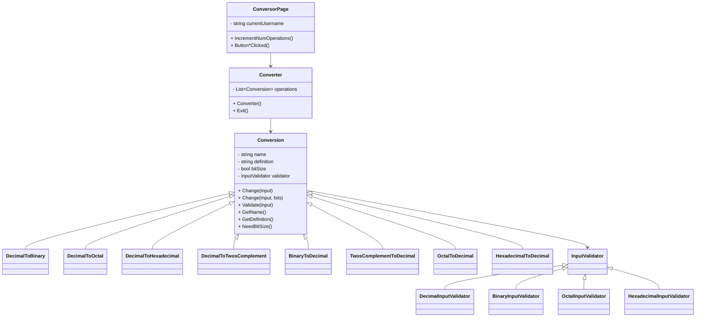

# Practical Work II – Design Detailed Document (DDD)

## Table of Contents

1. [Introduction](#introduction)
2. [Description](#description)
   - [Architecture Overview](#architecture-overview)
   - [Class Diagram](#class-diagram)
   - [Key Classes and Responsibilities](#key-classes-and-responsibilities)
   - [Design and Development Decisions](#design-and-development-decisions)
3. [Problems](#problems)
4. [Conclusions](#conclusions)

---

## Introduction

This document provides a detailed design overview of the "UFV Conversor" application, developed as part of Practical Work II for the OOP course. It describes the architecture, main classes, design decisions, encountered problems, and lessons learned during the development process.

---

## Description

### Architecture Overview

The application is a cross-platform .NET MAUI app that allows users to convert numbers between different bases (decimal, binary, octal, hexadecimal, and two's complement). It features user authentication, operation tracking, and a modular design for easy extension.

#### Main Components

- **UI Layer:** XAML pages (e.g., `ConversorPage.xaml`) for user interaction.
- **Logic Layer:** Classes in `Guided_Practice` for conversion logic and validation.
- **Persistence Layer:** CSV file (`users.csv`) for storing user data and operation counts.

### Class Diagram

### Key Classes and Responsibilities

- **ConversorPage:** Handles UI events, user input, and calls conversion logic. Tracks user operations.
- **Converter:** Manages available conversion operations.
- **Conversion (abstract):** Base class for all conversions, defines interface and shared logic.
- **[Specific Conversion Classes]:** Implement the `Change` method for each conversion type.
- **InputValidator (abstract):** Base class for input validation.
- **[Specific Validator Classes]:** Implement validation for each input type.

### Design and Development Decisions

- **Separation of Concerns:** UI, logic, and persistence are separated for maintainability.
- **Extensibility:** New conversions can be added by extending the `Conversion` class.
- **Validation:** Each conversion uses a specific validator to ensure input correctness.
- **User Tracking:** Operations are counted and stored in a CSV file for each user.
- **Error Handling:** All conversion actions are wrapped in try-catch blocks to provide user-friendly error messages.

---

## Problems

- **File Access:** Handling file paths and permissions for reading/writing the CSV file across platforms.
- **Input Validation:** Ensuring robust validation for all number systems and edge cases.
- **UI Responsiveness:** Managing asynchronous prompts and updates in the UI without blocking the main thread.
- **Extending Functionality:** Designing the system to easily support new conversions and validators.

---

## Conclusions

- **Lessons Learned:** The importance of modular design and clear separation of concerns for maintainability and extensibility.
- **Effectiveness:** The chosen architecture allowed for straightforward implementation of new conversions and validators.
- **Future Improvements:** Consider migrating from CSV to a database for better scalability and data integrity. Enhance UI/UX for better user feedback and accessibility.

---
